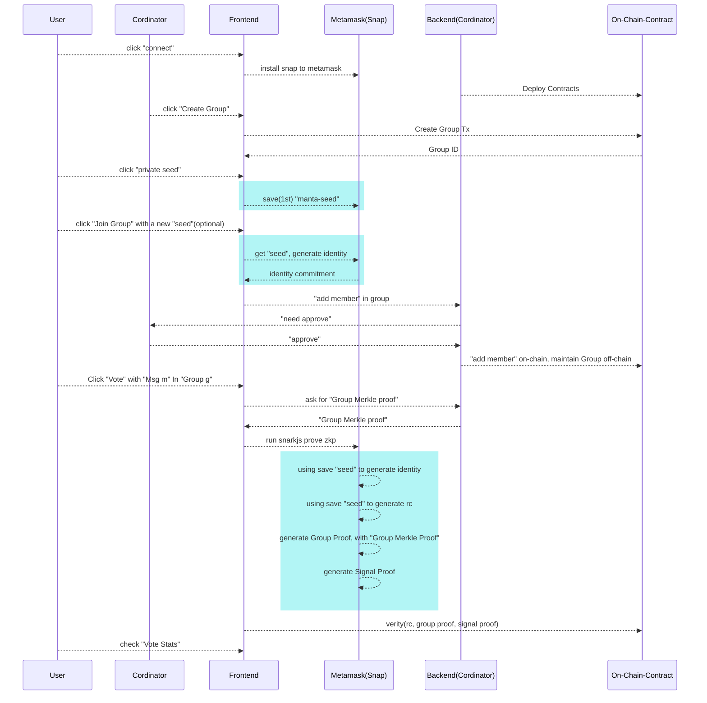

# Workflow

```mermaid
sequenceDiagram
	participant U 	as User
	participant O 	as Cordinator
	participant F 	as Frontend
	participant M 	as Metamask(Snap)
	participant B 	as Backend(Cordinator)
	participant C 	as On-Chain-Contract
	
  U -->> F : click "connect"
  F -->> M : install snap to metamask
  B -->> C : Deploy Contracts

  O -->> F : click "Create Group"
  F -->> C : Create Group Tx
  C -->> F : Group ID

  U -->> F : click "private seed"
  	rect rgba(0, 220, 220, .3)
    F -->> M : save(1st) "manta-seed"
  end

  U -->> F : click "Join Group" with a new "seed"(optional)
	rect rgba(0, 220, 220, .3)
    F -->> M : get "seed", generate identity
    M -->> F : identity commitment
  end
  F -->> B : "add member" in group
  B -->> O : "need approve"
  O -->> B : "approve"
  B -->> C : "add member" on-chain, maintain Group off-chain

  U -->> F : Click "Vote" with "Msg m" In "Group g"
  F -->> B : ask for "Group Merkle proof"
  B -->> F : "Group Merkle proof"
  F -->> M : run snarkjs prove zkp
	rect rgba(0, 220, 220, .3)
    M -->> M : using save "seed" to generate identity
    M -->> M : using save "seed" to generate rc
    M -->> M : generate Group Proof, with "Group Merkle Proof"
    M -->> M : generate Signal Proof 
  end
  F -->> C : verity(rc, group proof, signal proof)
  U -->> F : check "Vote Stats"

```

  